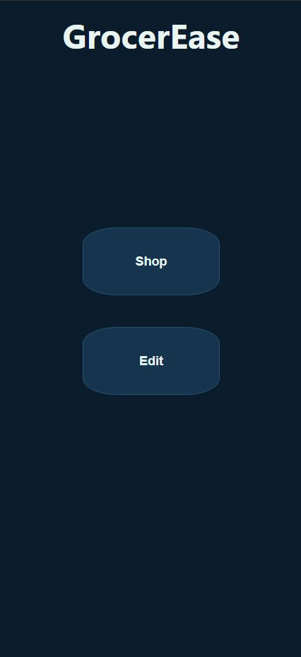
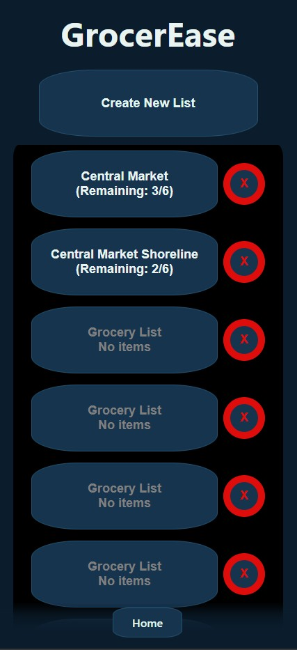
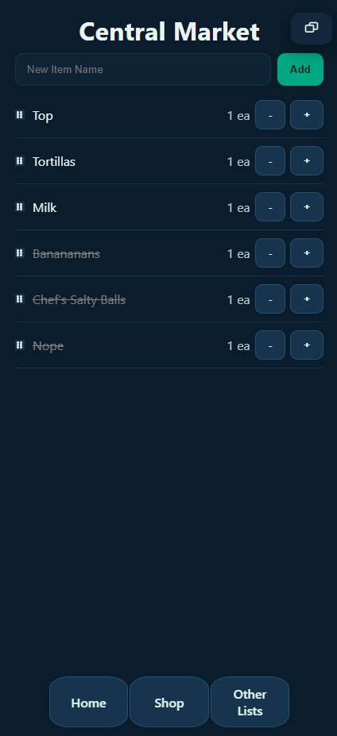
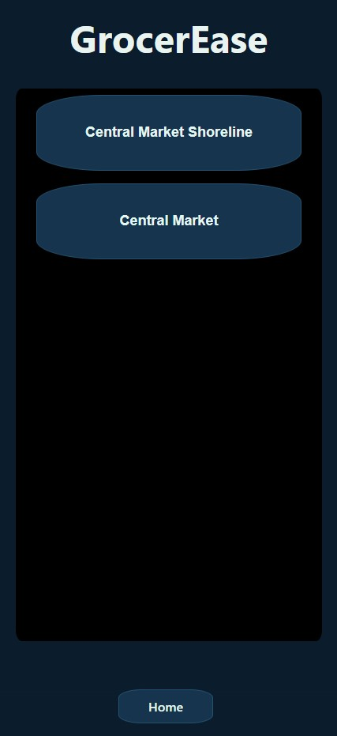
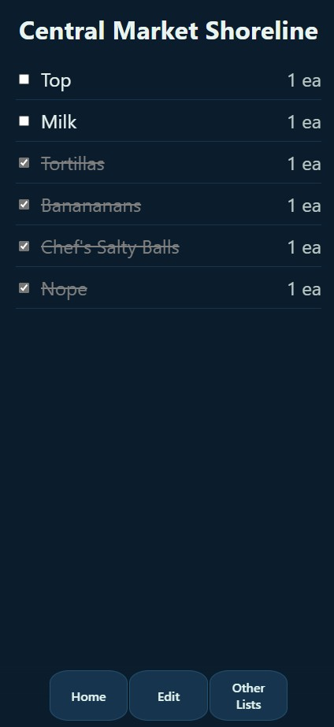

# GrocerEase

A simple, easy to use grocery list organizer.

Designed to make it frictionless to collaborate on grocery lists within a family.

This uses a "mobile first" approach since you always have your phone while shopping.

## Features

Local storage! Lists are stored on your phone, as part of the browser. No cookies are involved. No tracking. No ads. No connectivity issues trying to connect to any services.

Export lists! The list editor has the ability to copy a list and send it to anyone. When they click the link, they go straight to shopping mode!

List reording! Move the items around so they are grouped in the way YOU want.

## Screens

### Home

This is where you choose if you want to shop, or if you want to edit a list that is already on your phone.

### List Editing Selector

Here you can start working on a new list, work on an existing list, or remove a list.

Click the name of the list to edit it. Click the red X button to remove it from your phone.

### List Editor

Lets you edit or organize a shopping list.

Hold a click, or use a long tap, to change the name of the list.
Click the icon that looks like two boxes to export the list so it can be sent to anyone!

### Shopping Selector

Allows you to pick the list to shop from.

### Shopping

Lets you shop, and mark an item as done.

## Development

Scripts

- `npm run dev: start Vite dev server`
- `npm run build: type-check and production build`
- `npm run preview: preview production build`

Env modes

- `VITE_API_MODE=sim (default): in-memory simulator with latency`
- `VITE_API_MODE=mock: static mock data`
- `VITE_API_MODE=http: real HTTP API using VITE_API_BASE (e.g. http://localhost:5100)`

Path aliases

- This project expects the Vite alias `@ -> ./src`.
- If the dev server fails to resolve imports like `@/pages/Home`, add the alias in `vite.config.ts`:
  - resolve.alias = { '@': path.resolve(__dirname, './src') }
  - and import path: `import path from 'node:path'`

DI and services

- tsyringe container registers ListsService implementation based on VITE_API_MODE.
- Implementations: MockListsService, SimulatedListsService, HttpListsService.

PWA

- vite-plugin-pwa auto updates SW. Add real icons at public/icons/ for install banners.

Getting started

1. cd client
2. npm install
3. Ensure alias is configured (see Path aliases above)
4. npm run dev
